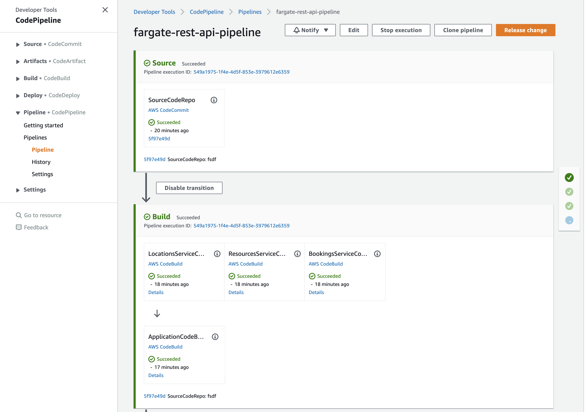

# javascript-ecs-nlb-sam
This is implementation of the backend API using AWS API Gateway HTTP endpoint, Node.js and AWS SAM. 

## Project structure
This project contains source code and supporting files for a serverless application that you can deploy with the AWS Serverless Application Model (AWS SAM) command line interface (CLI). It includes the following files and folders:

- `src\api` - Code for the application's containers
- `src\api\bookings` - Application code for the Bookings Service
- `src\api\bookings` - Unit tests for the Bookings Service
- `src\api\locations` - Application code for the Locations Service
- `src\api\locations` - Unit tests for the Locations Service
- `src\api\resources` - Application code for the Resources Service
- `src\api\resources` - Unit tests for the Resources Service
- `__tests__/integration` - Integration tests for the API. 
- `__tests__/testspec.yml` - A template that defines the API's test process used by the CI/CD pipeline (both unit and integration testing).
- `template.yaml` - A template that defines the application's AWS resources.
- `pipeline.yaml` - A template that defines the application's CI/CD pipeline.
- `buildspec.yml` - A template that defines the application's build process used by the CI/CD pipeline.

The application uses shared Amazon Cognito stack for authentication/authorization and a VPC stack for ECS networking. These stacks are included as nested stacks within `template.yaml`. 

## Deploying with CI/CD pipeline
You will use the CloudFormation CLI to deploy the stack defined within `pipeline.yaml`. This will deploy the required foundation which will allow you to make changes to your application and deploy them in a CI/CD fashion. 
    The following resources will be created:
        - CodeCommit repository for application code source control
        - Elastic Container Registry repositories for housing the application's container images
        - CodeBuild project for building and testing the application
        - CodePipeline for orchestrating the CI/CD process

To create the CI/CD pipeline we will split out code for this set of examples from the serverless-samples repository into a separate directory and use it as a codebase for our pipeline. 

First, navigate to the root directory of the repository. To verify it run command *basename "$PWD"* - it should return serverless-samples as an output. Then run the following commands:

```bash
git subtree split -P fargate-rest-api -b fargate-rest-api
mkdir ../fargate-rest-api-cicd && cd ../fargate-rest-api-cicd
git init -b main
git pull ../serverless-samples fargate-rest-api
cd javascript-rest-ecs-sam
```

To create the pipeline you will need to run the following command:

```bash
aws cloudformation create-stack --stack-name fargate-api-pipeline --template-body file://pipeline.yaml --capabilities CAPABILITY_IAM
```

Once the stack is created, the pipeline will attempt to run and will fail at the SourceCodeRepo stage as there is no code in the AWS CodeCommit yet.

***NOTE:** If you change stack name, avoid stack names longer than 25 characters. IUn case you need longer stack names check comments in the pipeline.yaml and update accordingly.*

***Note:** You may need to set up AWS CodeCommit repository access for HTTPS users [using Git credentials](https://docs.aws.amazon.com/codecommit/latest/userguide/setting-up-gc.html?icmpid=docs_acc_console_connect_np) and [set up the AWS CLI Credential Helper](https://docs.aws.amazon.com/console/codecommit/connect-tc-alert-np).*

Once you have access to the code repository, run the following command:

```bash
git remote add origin <URL to AWS CodeCommit repository -- provided in Outputs when creating pipeline stack>
git push origin main
```

Navigate to the CodePipeline in AWS Management Console and release this change if needed by clicking "Release change" button.



Note that same Amazon Cognito stack is used in both testing and production deployment stages, same user credentials can be used for testing and API access.

## Amazon Cognito setup
This example uses shared stack that deploys Amazon Cognito resources, it will be deployed automatically if you use CI/CD pipeline. 

See [README.md](../shared/README.md) in shared resources directory for the stack manual deployment instructions. After manual deployment is finished make sure to update your SAM template file `template.yaml` parameter CognitoStackName with the shared Cognito stack name. 

After stack is created manually you will need to create user account for authentication/authorization (CI/CD pipeline will perform those steps for you automatically):

- Navigate to URL specified in the shared stack template outputs as CognitoLoginURL and click link "Sign Up". After filling in new user registration form you should receive email with verification code, use it to confirm your account. 

- After this first step step your new user account will be able to access public data and create new bookings. To add locations and resources you will need to navigate to AWS Console, pick Amazon Cognito service, select User Pool instance that was created during this deployment, navigate to "Users and Groups", and add your user to administrative users group. 

- As an alternative to the AWS Console you can use AWS CLI to create and confirm user signup:
```bash
    aws cognito-idp sign-up --client-id <cognito user pool application client id> --username <username> --password <password> --user-attributes Name="name",Value="<username>"
    aws cognito-idp admin-confirm-sign-up --user-pool-id <cognito user pool id> --username <username> 
```

While using command line or third party tools such as Postman to test APIs, you will need to provide Identity Token in the request "Authorization" header. You can authenticate with Amazon Cognito User Pool using AWS CLI (this command is also available in SAM template outputs) and use IdToken value present in the output of the command:

```bash
aws cognito-idp initiate-auth --auth-flow USER_PASSWORD_AUTH --client-id <cognito user pool application client id> --auth-parameters USERNAME=<username>,PASSWORD=<password>
```

## Unit tests
Unit tests are defined in the `__tests__\unit` folder in this project. Use `npm` to install the [Jest test framework](https://jestjs.io/) and run unit tests.

```bash
my-application$ npm install
my-application$ npm run test:unit
```

## Cleanup

# TO DO